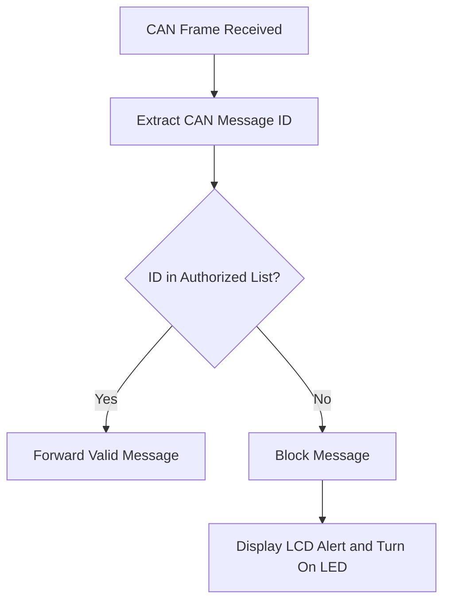

# Intelligent Automotive Gateway & Intrusion Detection System

An STM32F446RE-based embedded automotive security gateway developed in Embedded C. The system monitors CAN bus traffic, allows authorized message IDs, blocks unauthorized messages, and provides real-time intrusion alerts using an LCD and LED indicators.

## Project Overview

Modern vehicles use Controller Area Network (CAN) communication for exchanging data between electronic control units such as the engine controller, braking system, dashboard, and body control modules.

Since classical CAN does not provide built-in message authentication, unauthorized devices can inject messages into the bus. This project implements a basic CAN gateway and intrusion detection mechanism using an authorized message ID whitelist.

The gateway performs the following operations:

1. Receives a CAN message.
2. Extracts the message identifier.
3. Compares the identifier with the authorized ID list.
4. Forwards valid messages.
5. Blocks unauthorized messages.
6. Activates an intrusion alert on the LCD and LED.

## Key Features

- STM32F446RE microcontroller-based implementation.
- Embedded C firmware.
- CAN message reception and transmission.
- Authorized CAN ID whitelist.
- Blocking of unauthorized CAN traffic.
- Real-time intrusion detection.
- LCD-based alert display.
- LED-based visual warning.
- Testing with both valid and invalid CAN messages.
- Message filtering at the gateway level.

## System Workflow



## Hardware Requirements

- STM32F446RE development board
- CAN transceiver
- CAN bus connection
- LCD display
- LED indicator
- CAN testing node or CAN analyzer
- Required power and connecting wires

## Software Requirements

- Embedded C
- STM32CubeIDE
- STM32CubeMX configuration
- STM32 HAL CAN driver
- Git and GitHub

Update the software tools according to the actual development environment used in the project.

## Message Filtering Logic

The firmware maintains a list of authorized CAN message IDs.

Example authorized IDs:

```c
static const uint32_t authorized_ids[] =
{
    0x100U,
    0x101U,
    0x200U
};
```

These IDs are only examples. They must be replaced with the actual CAN IDs used during testing.

When a CAN frame is received:

- If its ID exists in the authorized list, the frame is accepted and forwarded.
- If its ID is not present, the frame is rejected and treated as suspicious traffic.

## Intrusion Detection

An unauthorized CAN message is considered a possible intrusion attempt.

When unauthorized traffic is detected:

- The message is not forwarded.
- The blocked-message counter is incremented.
- The intrusion LED is activated.
- The received unauthorized ID is displayed on the LCD.

Example alert:

```text
INTRUSION DETECTED
BLOCKED ID: 0x555
```

## Testing

| Test Case | Expected Result |
|---|---|
| Authorized CAN ID | Message accepted and forwarded |
| Unauthorized CAN ID | Message blocked |
| Invalid traffic detected | LCD alert displayed |
| Intrusion event | LED indicator activated |
| Multiple invalid messages | Block counter increases |

## Example System Behavior

### Valid Message

```text
Received ID: 0x100
Status: Authorized
Action: Message forwarded
Alert: None
```

### Invalid Message

```text
Received ID: 0x555
Status: Unauthorized
Action: Message blocked
Alert: LCD and LED activated
```

## Suggested Repository Structure

```text
intelligent-automotive-gateway-ids/
├── README.md
├── STM32F446RE_CAN_Gateway.ioc
├── Core/
│   ├── Inc/
│   │   ├── gateway_filter.h
│   │   └── lcd_driver.h
│   └── Src/
│       ├── main.c
│       ├── gateway_filter.c
│       └── lcd_driver.c
├── Drivers/
├── docs/
│   └── system-architecture.png
├── .gitignore
└── LICENSE
```

## How to Build and Run

1. Clone this repository.

2. Open the STM32 project in STM32CubeIDE.

3. Verify the following configuration:
   - STM32F446RE target device
   - CAN peripheral pins
   - CAN bitrate
   - CAN receive FIFO
   - LCD GPIO pins
   - Intrusion LED GPIO pin
   - Authorized CAN ID list

4. Build the project.

5. Flash the firmware to the STM32F446RE board.

6. Connect the CAN bus and start sending test frames.

7. Observe:
   - Authorized messages being forwarded.
   - Unauthorized messages being blocked.
   - LCD intrusion notification.
   - LED intrusion indication.

## Security Scope

This project implements ID-based CAN message filtering and intrusion detection. It is intended for embedded automotive cybersecurity prototyping and academic demonstration.

The current implementation does not provide cryptographic message authentication, encryption, or complete production-grade automotive security. These features can be added in future versions.

## Future Improvements

- CAN message frequency monitoring.
- Replay attack detection.
- Message counter validation.
- Cryptographic authentication using CMAC or HMAC.
- Secure logging of intrusion events.
- CAN-FD support.
- UDS security access integration.
- Configurable whitelist stored in protected memory.
- Real-time communication with a security monitoring dashboard.

## Author

Developed using STM32F446RE, Embedded C, and CAN communication.

## License

This project is intended for educational and research purposes.
